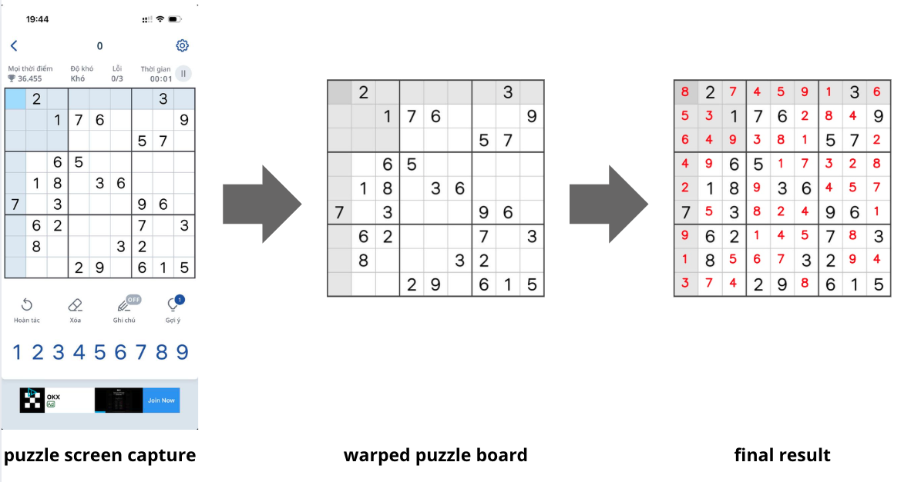
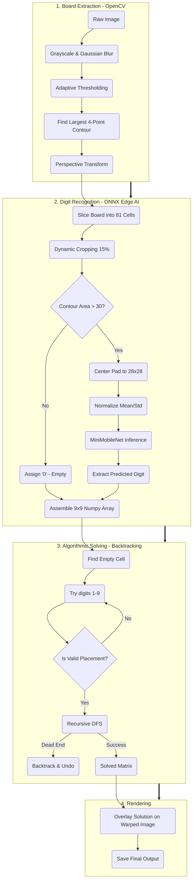

# Sudoku-net: real-time sudoku solver with deep learning

[](https://pytorch.org/)
[](https://onnx.ai/)
[]()
[]()



This repository demonstrates an end-to-end pipeline, from designing a lightweight Custom CNN architecture to deploying it for high-throughput inference using ONNX Runtime to extract and solve sudoku puzzles.

## System Architecture

The pipeline is designed with a modular architecture, separating Computer Vision tasks, Deep Learning inference, and Algorithmic problem-solving into distinct stages.

```mermaid
graph LR
    A[Puzzle Screen Capture] -->|Input| B(Sudoku Detector <br/> OpenCV)
    B -->|Warped Top-Down Image| C(Digit Recognizer <br/> ONNX MiniMobileNet)
    C -->|Unsolved 9x9 Matrix| D(Sudoku Solver <br/> Backtracking)
    D -->|Solved 9x9 Matrix| E(Visualizer <br/> OpenCV)
    E -->|Output| F[Annotated Result Image]

    classDef opencv fill:#e1f5fe,stroke:#03a9f4,stroke-width:2px;
    classDef onnx fill:#e8f5e9,stroke:#4caf50,stroke-width:2px;
    classDef algo fill:#fff3e0,stroke:#ff9800,stroke-width:2px;

    class A,F default;
    class B,E opencv;
    class C onnx;
    class D algo;
```



## End-to-end image processing pipeline



## Classifer model

- **Custom Edge Architecture:** Stripped down 13-block MobileNet to a highly efficient 5-block `MiniMobileNet`, reducing parameters from ~3.2M to ~150K.
- **Native Resolution Processing:** Bypasses the standard 224x224 resize, processing 28x28 images directly to maximize throughput.
- **Production-Ready Export:** Utilizes PyTorch 2.x `onnxscript` and `opset_version=18` for modern, stable, and dynamic-batch ONNX generation.
- **Comprehensive Benchmarking:** Includes a robust evaluation script to verify mathematical correctness and measure latency/throughput against the full 10,000-image test set.

## Benchmark Results (CPU)

A head-to-head comparison between the native PyTorch engine and ONNX Runtime (`CPUExecutionProvider`) over the entire MNIST Test Dataset (10,000 images, Batch Size = 64).

> Note: Benchmark results below are on my local machine macbook air M2

### Accuracy Validation

Both models retain identical predictive performance, proving the mathematical integrity of the ONNX graph translation.

- **PyTorch Accuracy:** `99.09 %` (9909 / 10000)
- **ONNX Accuracy:** `99.09 %` (9909 / 10000)

### Speed & Throughput

ONNX Runtime significantly accelerates inference through operator fusion and removal of autograd overhead.

- **PyTorch Total Time:** `4.94 seconds` (~2023 FPS)
- **ONNX Total Time:** `0.69 seconds` (~14547 FPS)

> **Conclusion:** ONNX Runtime processes images **7.19x faster** than native PyTorch on the CPU without any degradation in accuracy.

## Project Structure

- `mobilenet.py`: Contains the model architecture (`DepthwiseSeparableConv` and `MiniMobileNet`).
- `train.py`: The training pipeline with CLI arguments, automatic checkpointing, and matplotlib metric tracking.
- `export_onnx.py`: Script to convert the `.pth` weights into an optimized `.onnx` graph.
- `benchmarkt.py`: The evaluation script comparing the two engines.
- `extract_puzzle.py`: Script to extract sudoku board and corresponding numbers, then display results nicely on terminal.
- `solver.py`: Backtracking algo to solve sudoku puzzles.
- `weights`: folder contains trained weights including both `.pth` and `.onnx` models.

## Quick Start

**1. Install Dependencies**

```bash
uv venv
source .venv/bin/activate
uv pip install torch torchvision onnx onnxscript onnxruntime matplotlib tqdm scipy scikit-image
```

**2. Training**

```bash
python train.py --epochs 30 --batch-size 64 --lr 0.0005 --weight-file output/sudoku-net.pth --plot-file output/report.png
```

**3. Export to ONNX**

```bash
uv run export_onnx.py
```

**4. Benchmark**

```bash
uv run benchmark.py
```

**5. Compare Inference speed**

```bash
uv run compare_inference.py
```

**6. Test board extraction**

```bash
uv run extract_puzzle.py
```

**7. End-to-end run**

```bash
uv run main.py
```
